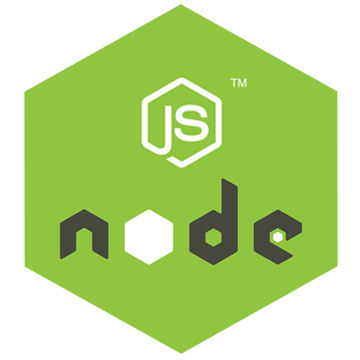

# Instagram Clone | 🖥Web 

|                     React                     |                    NodeJS                    |                     ES6                     |
| :-------------------------------------------: | :------------------------------------------: | :-----------------------------------------: |
|  |  |  |

|                  GraphQl                   |                     Apollo                     |                  React Hooks                  |
| :----------------------------------------: | :--------------------------------------------: | :-------------------------------------------: |
|  |  |  |

|                styled component                |
| :--------------------------------------------: |
|  |

## Document

| Title    | Description                          | Description                              |
| -------- | ------------------------------------ | ---------------------------------------- |
| Styles   | Style skill with styled-component    | [Documentation](./Documents/Styles.md)   |
| Queries  | Communicate with server from client  | [Documentation](./Documents/Queries.md)  |
| Router   | Managing pages with react-router-dom | [Documentation](./Documents/Router.md)   |
| Frontend | The skills to make frontend part     | [Documentation](./Documents/Frontend.md) |

## Setup

```bash
    $ yarn add styled-components graphql apollo-boost react-apollo-hooks react-router-dom react-helmet styled-reset react-toastify react-autosize-textarea
```

